# PMOD boards for ULX3S

    [x] PMOD RFM9X
    [x] PMOD OV7670
    [x] PMOD HDMI Input/output
    [ ] PMOD CAN bus
    [ ] PMOD LVDS
    [ ] PMOD LCD
    [x] PMOD MLX90640
    [ ] PMOD ethernet
    [ ] PMOD SX1257
    [ ] PMOD I2S Audio
    [x] PMOD I2S microphone
    [x] PMOD DB9
    [x] PMOD SD Card
    [ ] PMOD VGA
    [ ] PMOD PS/2
    [ ] PMOD Poteciometers
    [ ] PMOD RaspiCam - May not be needed 

LoRa front

LoRa back

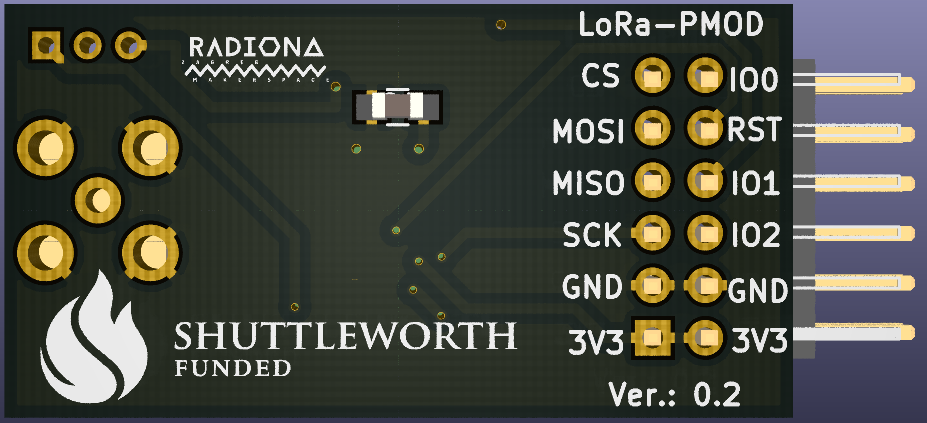

LoRa rotate

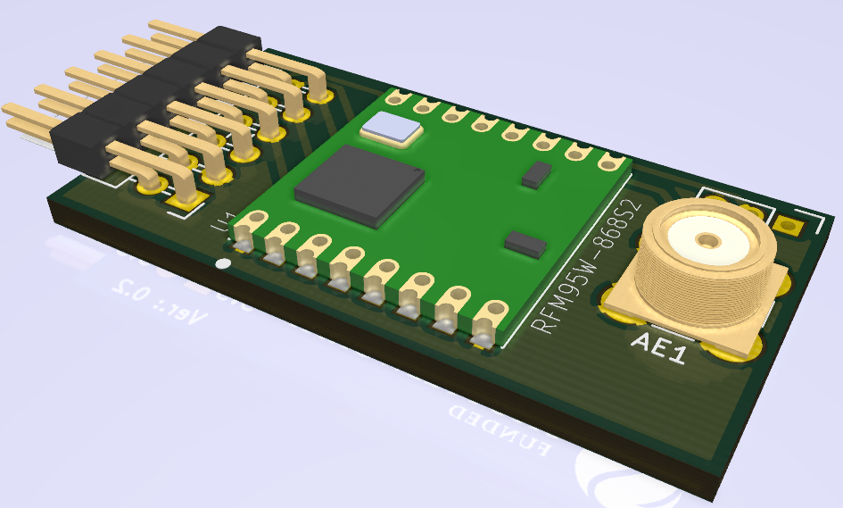

OV7670 front

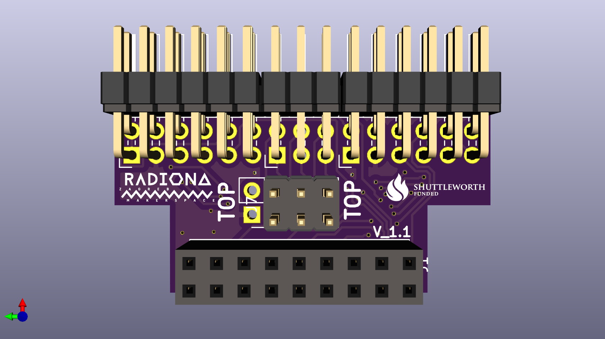

OV7670 back

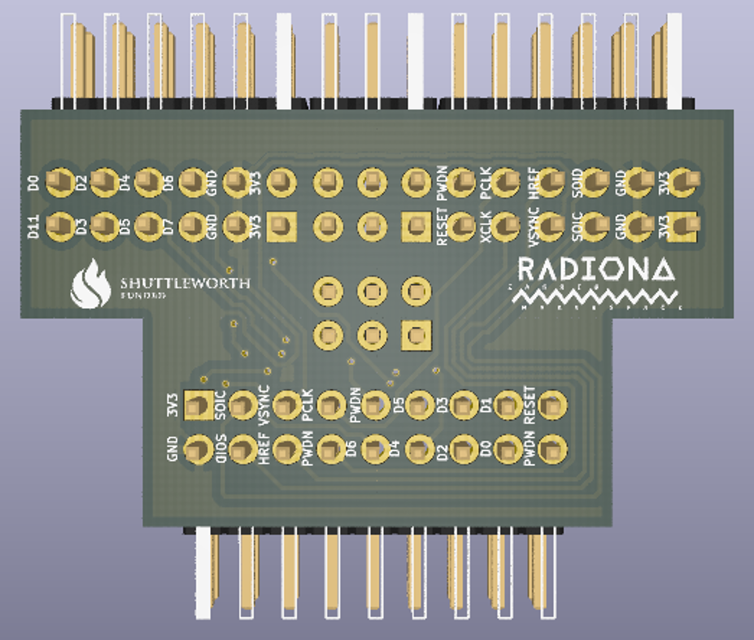

OV7670 rotate

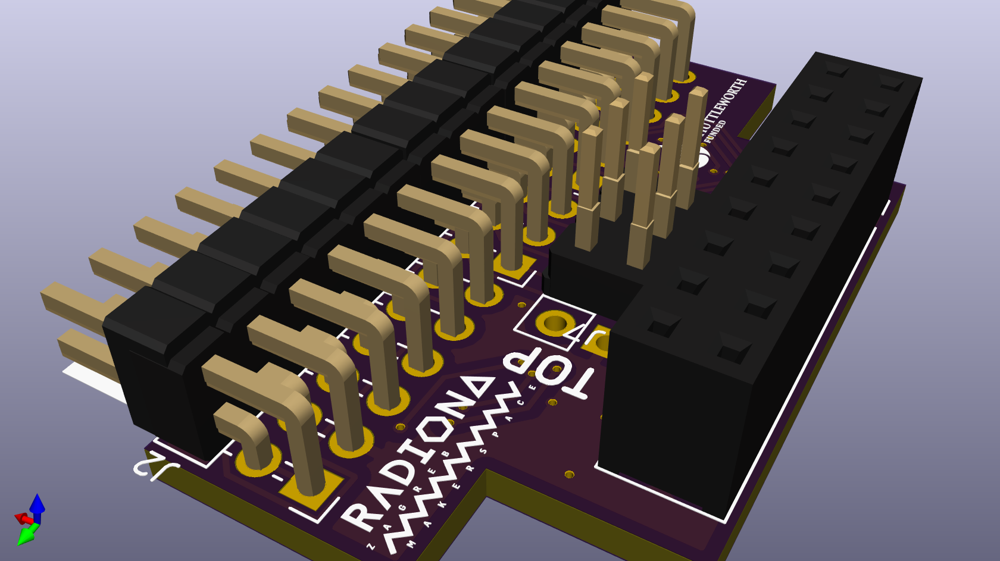

HDMI front

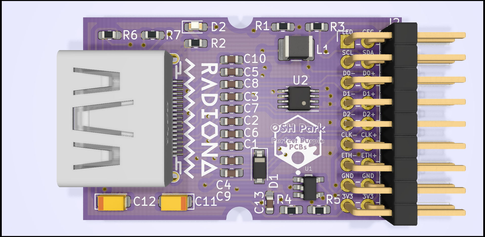

HDMI back

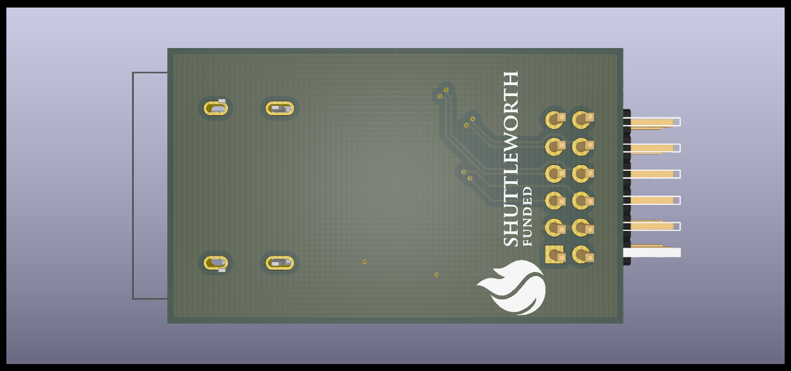

HDMI rotate

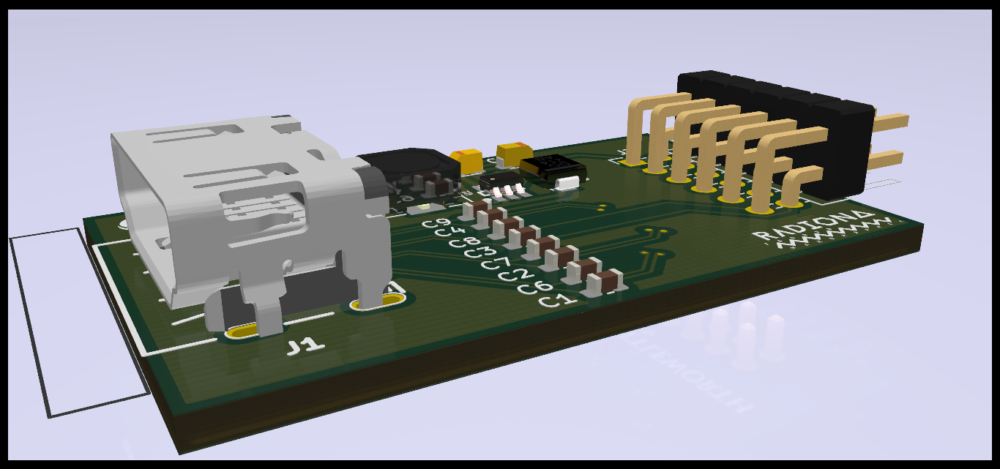

MLX90640 front

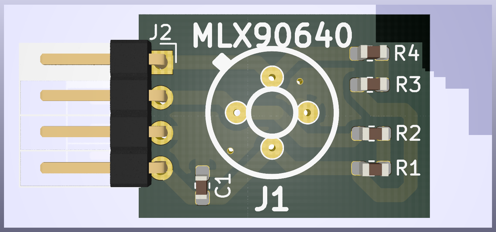

MLX90640 back

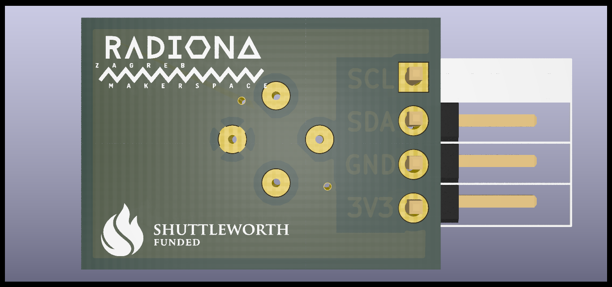

I2SMIC front

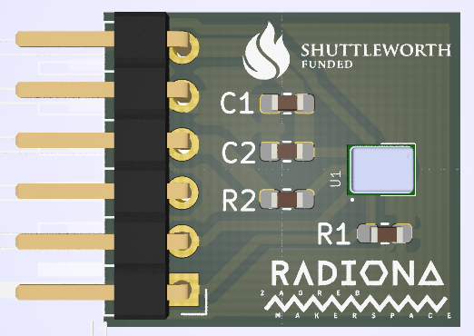

I2SMIC back

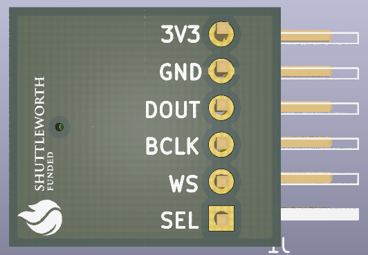

I2SMIC rotate

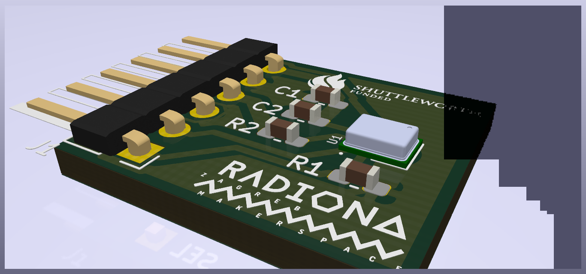

SD front

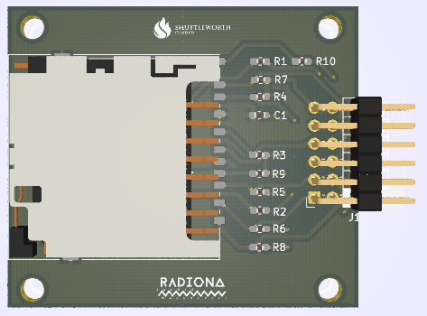

SD back

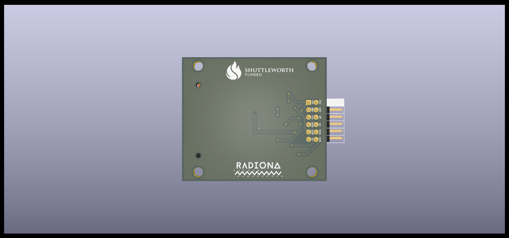

PB9 back

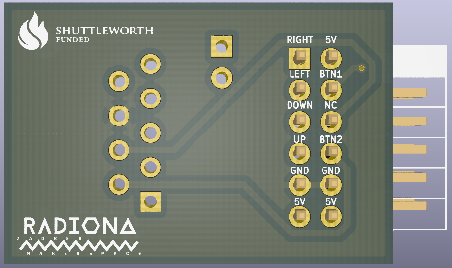

Helping hands: Marvin(Radiona), Emard(Radiona), Prizma(Radiona), mmicko
