# PMOD boards for ULX3S

    [x] PMOD RFM9X
    [x] PMOD OV7670
    [x] PMOD HDMI Input/output
    [x] PMOD MLX90640
    [x] PMOD I2S microphone
    [x] PMOD DB9
    [x] PMOD SD Card
    [x] PMOD MAX31855
    [x] PMOD ENC28J60
    [o] PMOD I2S Audio
    [o] PMOD MIDI in/out
    [o] PMOD Poteciometers
    [ ] PMOD VGA
    [ ] PMOD Rotary encoder
    [ ] PMOD DC Motor with encoder
    [ ] PMOD LCD - DS90CF363B    
    [ ] PMOD CH376
    [ ] PMOD CAN bus
    [ ] PMOD LVDS
    [x] PMOD SX1257 - Already in development
    [x] PMOD RaspiCam - https://github.com/daveshah1/pmods
 
LoRa front

LoRa back

LoRa rotate

MicroUSB front

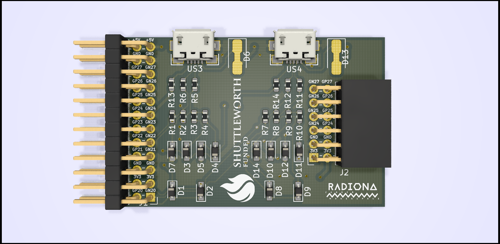

MicroUSB back

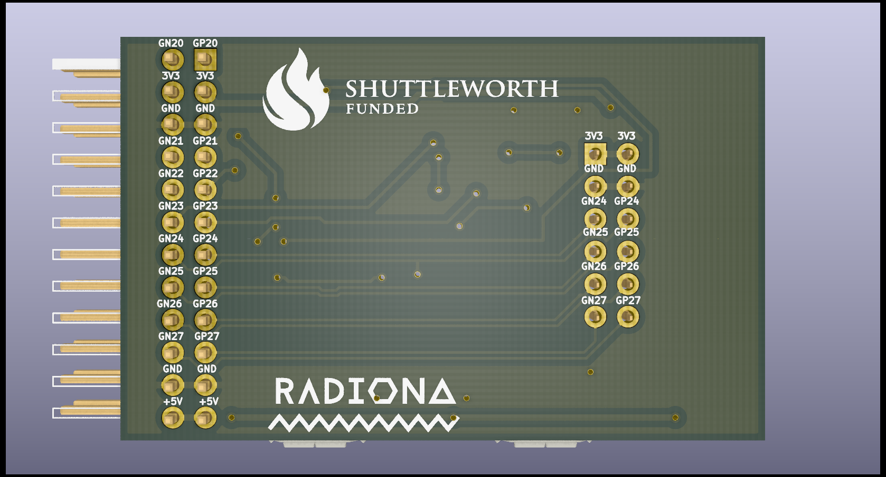

MicroUSB rotate

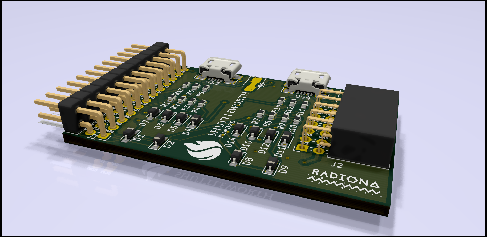

USB front

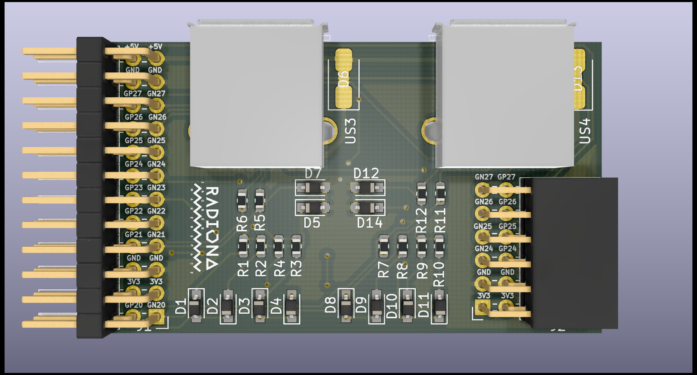

USB back

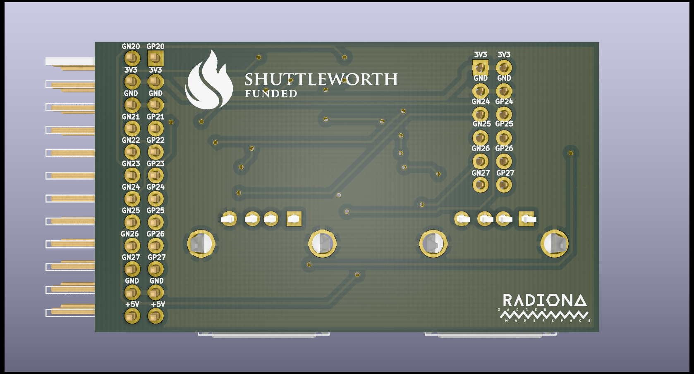

USB rotate

ENC28J60 front

ENC28J60 rotate

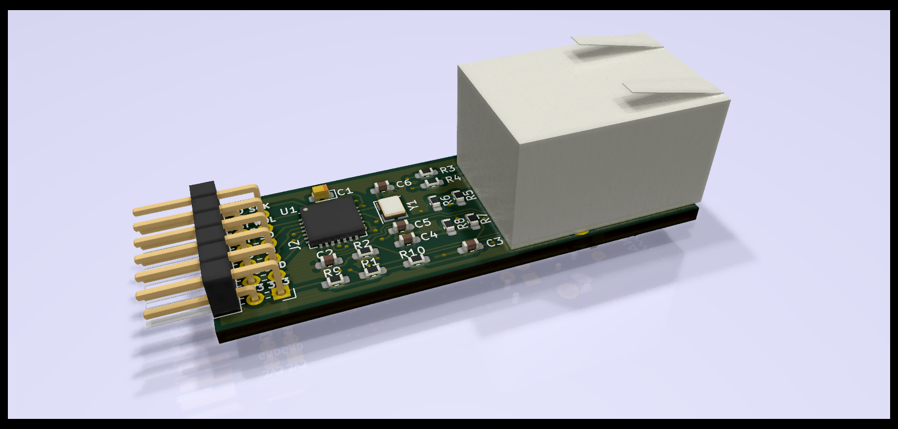

HDMI front

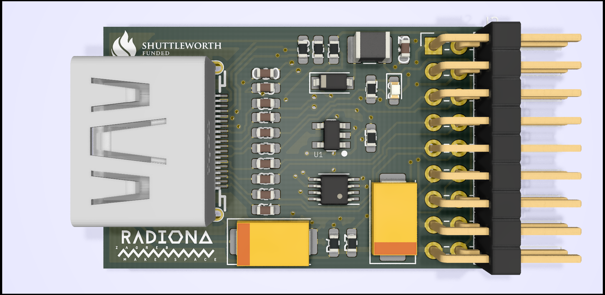

HDMI back

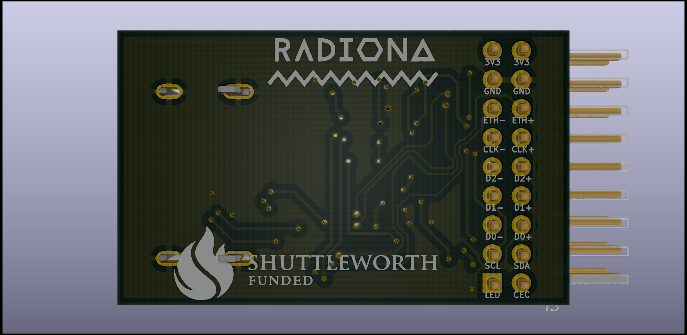

HDMI rotate

Potenciometar front

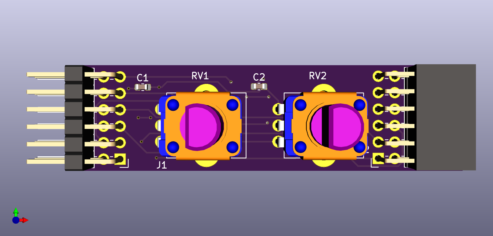

Potenciometar back

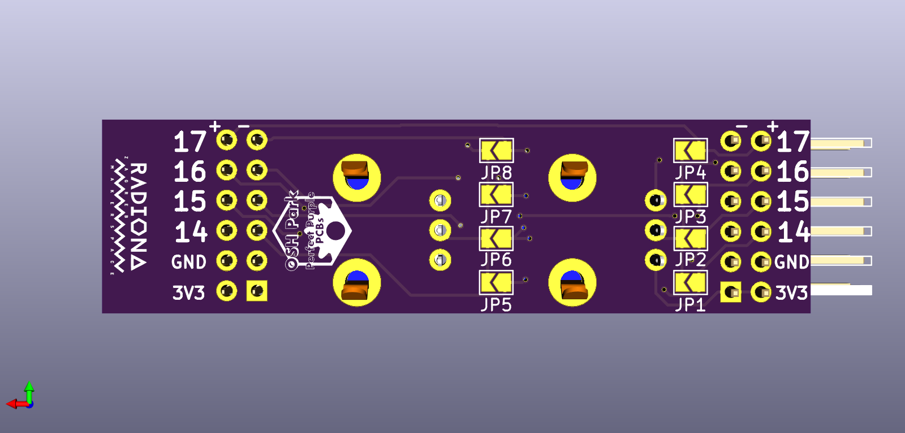

Potenciometar rotate

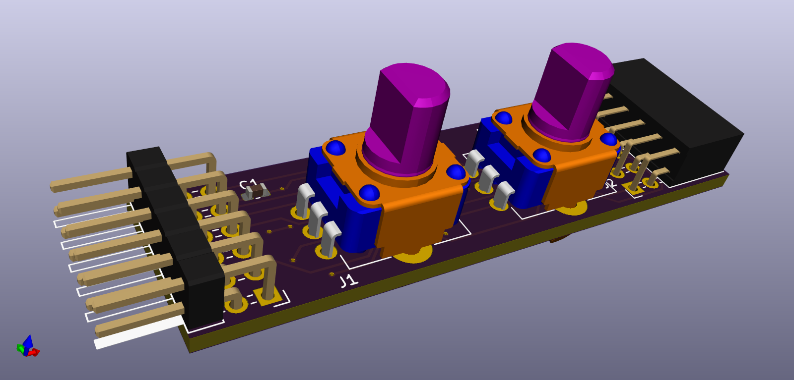

MIDI rotate

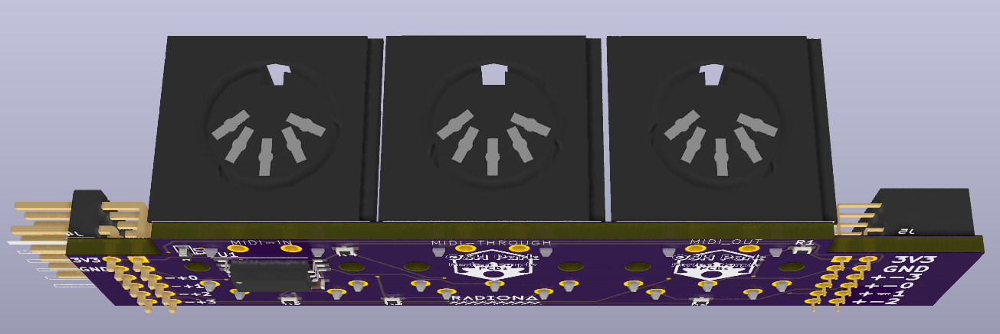

OV7670 front

OV7670 back

OV7670 rotate

MLX90640 front

MLX90640 back

I2SMIC front

I2SMIC back

I2SMIC rotate

SD front

SD back

PB9 back

MAX31855 front

MAX31855 back

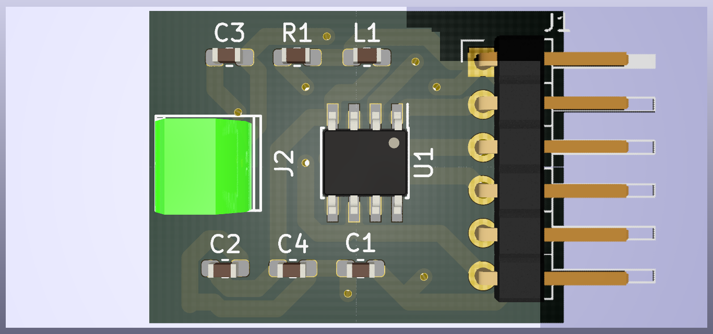

MAX31855 rotate

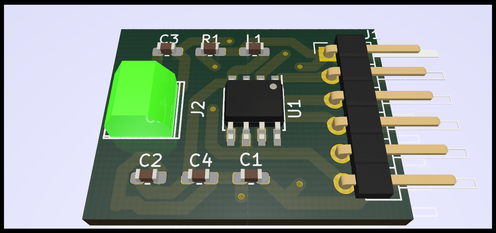

 

Helping hands: Marvin(Radiona), Emard(Radiona), Prizma(Radiona), mmicko, Drew Fustini (OSH Park), SnapEDA, smunaut(tnt)
