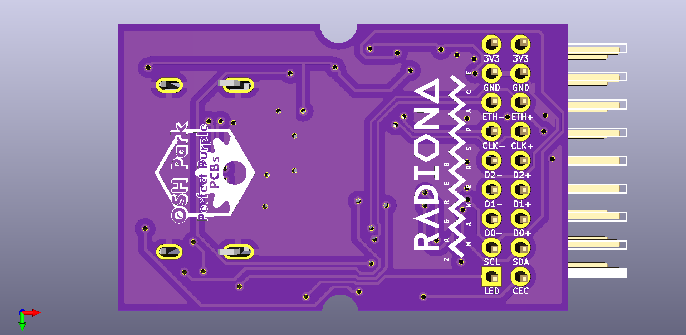
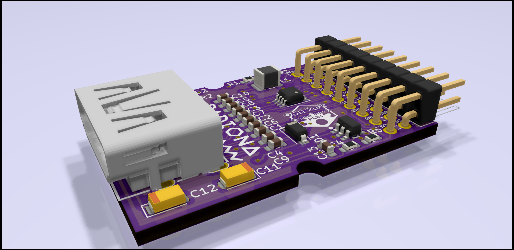
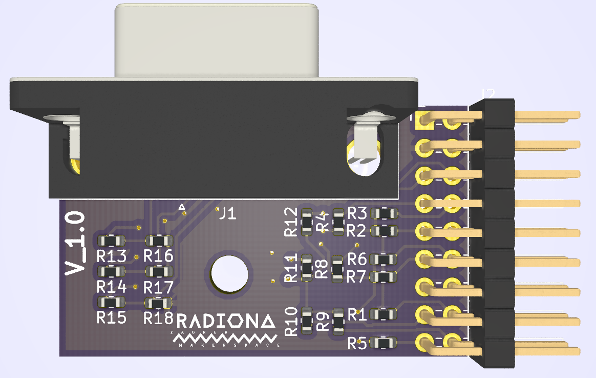
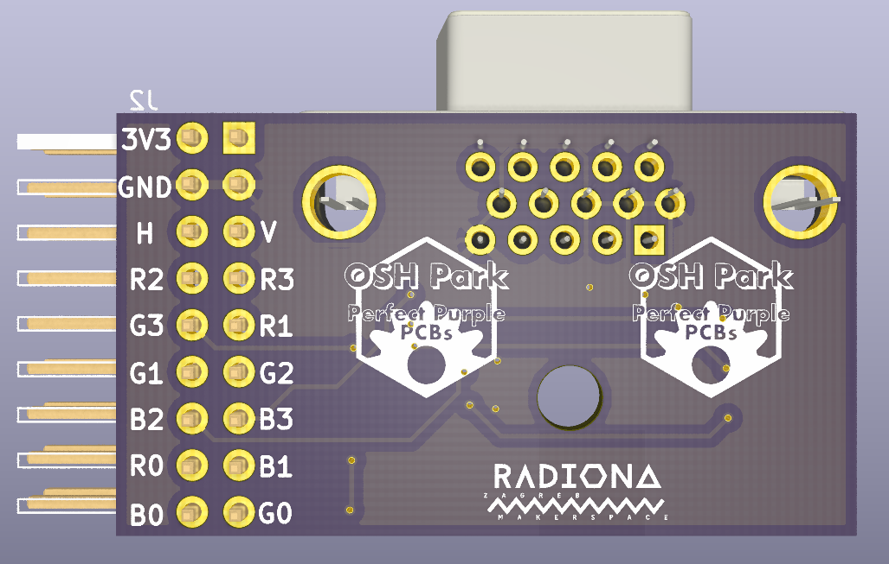

# Extension boards for ULX3S

    [x] RFM9X
    [x] OV7670
    [x] GPDI Input/output
    [x] MLX90640
    [x] I2S microphone
    [x] DB9
    [x] SD Card
    [x] MAX31855
    [x] ENC28J60
    [o] I2S Audio
    [o] MIDI in/out
    [o] Poteciometers
    [o] VGA
    [ ] Rotary encoder
    [ ] DC Motor with encoder
    [ ] LCD - DS90CF363B    
    [ ] CH376
    [ ] CAN bus
    [ ] LVDS
    [x] SX1257 - Already in development
    [x] RaspiCam - https://github.com/daveshah1/pmods
 
LoRa front

LoRa back

LoRa rotate

MicroUSB front

MicroUSB back

MicroUSB rotate

USB front

USB back

USB rotate

ENC28J60 front

ENC28J60 rotate

GPDI front

GPDI back

GPDI rotate

Potenciometar front

Potenciometar back

Potenciometar rotate

MIDI rotate

VGA front

VGA back

OV7670 front

OV7670 back

OV7670 rotate

MLX90640 front

MLX90640 back

I2SMIC front

I2SMIC back

I2SMIC rotate

SD front

SD back

PB9 back

MAX31855 front

MAX31855 back

MAX31855 rotate

 

Helping hands: Marvin(Radiona), Emard(Radiona), Prizma(Radiona), mmicko, Drew Fustini (OSH Park), SnapEDA, smunaut(tnt)
